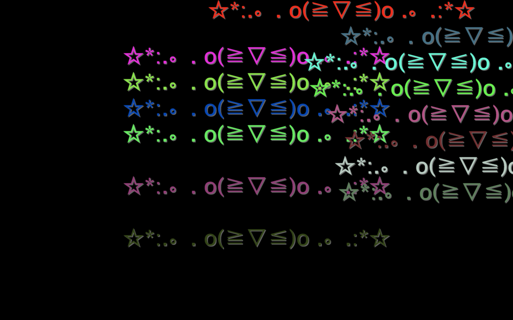

# cuddly-telegram-newyear2016

HSEFZ 2016元旦文艺汇演弹幕屏

由于服务端未设置 `Access-Control-Allow-Origin` 的 HTTP 头，调试/运行时需要使用扩展暂时绕过浏览器同源策略的控制  
Firefox：[cors everywhere](https://addons.mozilla.org/zh-CN/firefox/addon/cors-everywhere/)  
Chrome：[Access-Control-Allow-Origin: *](https://chrome.google.com/webstore/detail/allow-control-allow-origi/nlfbmbojpeacfghkpbjhddihlkkiljbi)

↓ Unicode 字符测试 √

主程序 `index.html`
===================

为防止服务器发抽，连续收到两条文字内容相同的消息时会忽略

弹幕后台 `sender.html`
=====================

Firefox / Chrome / Safari 均工作正常，但同样存在同源策略问题……

Position 可以选择 top、bottom 或者 top-stick（Admin 专用）

两个按钮分别为“发送”和“随机选取一个颜色并发送”，在 Web Console 里可以看到所有发送的 HTTP 请求

审核程序 `monitor.html`
=======================

只是一个不能用的原型，并非本次汇演最终使用的版本

点击一条弹幕进行删除，按下空格键可以暂停，其余同上…………

无聊的 `index-check.html`
=========================

并不会显示弹幕，所有接收到的弹幕信息会全部进入 Web Console。

lsq 通过这里观察到了同一条弹幕刷屏的规律（似乎是服务器的 bug）并修复。

TODO
====

* ~~测试文字阴影与导播机/大屏幕的综合效果并进行调整（于 2015/12/29 下午进行）~~（完成，效果拔群）
* ~~使用浅一点的蓝色（`#00f` 在大屏幕上效果不佳）~~（完成）

名称来源
========

GitHub 创建新项目时的自动提示

许可证
======

[The MIT/Expat License](LICENSE)
